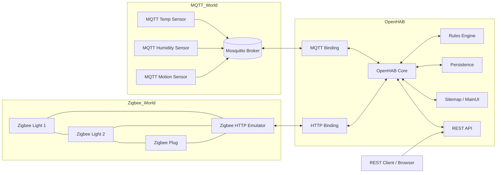

# Multi-Protocol IoT Gateway (OpenHAB + MQTT + Zigbee HTTP Emulation)

## Архітектура



## Запуск

```bash
docker-compose up -d
```

1. Відкрити `http://localhost:8080`.
2. В OpenHAB UI встановити:
   - MQTT Binding
   - HTTP Binding
   - JSONPath Transformation
   - MapDB Persistence (за потреби через UI)
3. Перевірити, що sitemap `home` доступний (Basic UI / MainUI → sitemaps).

## Протокольна трансформація

- MQTT сенсори публікують у топіки:
  - `sensors/temp1/state`
  - `sensors/hum1/state`
  - `sensors/motion1/state`
- MQTT Binding мапить їх на Items `MQTT_Temp01`, `MQTT_Hum01`, `MQTT_Motion01`.
- HTTP Binding звертається до `zigbee-sim`:
  - `GET /devices/zb_light_1` → JSON → `ZB_Light_1` (JSONPATH: `$.state`)
  - `POST /devices/zb_light_1` з `{"state":"ON"}` → змінює стан лампи.
- Rules синхронізують стан:
  - `MQTT_Motion01 == ON` → `ZB_Light_1.sendCommand(ON)`.

## REST API (OpenHAB як єдиний endpoint)

### Device discovery

```bash
curl -X GET "http://localhost:8080/rest/items?tags=gVirtualDevices" -H "Accept: application/json"
```

або просто:

```bash
curl -X GET "http://localhost:8080/rest/items" -H "Accept: application/json"
```

та фільтрація по групі / іменах.

### Status monitoring

```bash
curl -X GET "http://localhost:8080/rest/items/MQTT_Temp01" -H "Accept: application/json"
curl -X GET "http://localhost:8080/rest/items/ZB_Light_1" -H "Accept: application/json"
```

### Control commands

```bash
curl -X POST "http://localhost:8080/rest/items/ZB_Light_1" \
  -H "Content-Type: text/plain" \
  --data "ON"
```

## Demo сценарій (для відео)

1. Відкрити sitemap `home` у браузері.
2. Почекати, поки `MQTT_Motion01` стане `ON` → автоматично вмикається `ZB_Light_1`.
3. Показати зміну стану Zigbee-лампи через REST:

```bash
curl -X POST "http://localhost:8080/rest/items/ZB_Light_1" \
  -H "Content-Type: text/plain" \
  --data "OFF"
```

4. Показати історію станів (якщо налаштовано persistence).

